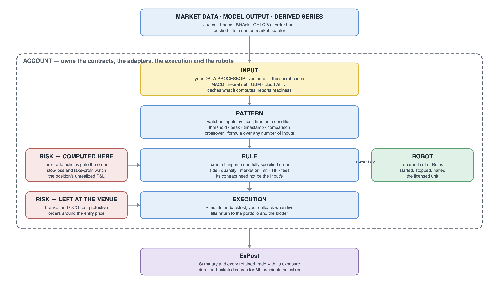

# Trading Strategy Engine — examples

The Trading Strategy Engine is a backtesting and trading engine: one shared library behind one narrow C ABI, with C++ and Python wrappers over it, which turns a stream of market data into orders and orders into a book of statistics. The engine is not in this repository.

What is here is twenty-nine strategies written against it, each one twice — once in C++ and once in Python, the same strategy on both surfaces. They are the worked examples of the engine's reference manual, ordered as a course rather than as a catalogue, and they are what a robot looks like when it is written for this engine.

## The whole assembly at a glance



Every robot is assembled by the same twelve declarations, in the same order, and none of them is optional. The account is created; an adapter is opened for the shape of market data that will arrive; an execution is attached; the traded contracts are declared; an Input is given its processor; a Pattern is pointed at that Input; a Rule is pointed at that Pattern; a Robot is given its rules; the robot is started; data is pushed tick by tick; the summary is read; the account is destroyed. The three surfaces differ in spelling alone — the same twelve steps in the same order on each.

Read the diagram in that order and the chain explains itself: the outside world stops at the adapter, your own thinking lives in the input and nowhere else, the pattern is where thinking becomes a decision, the rule is where a decision becomes a fully specified instruction, the robot is the thing you switch on, and the account is what owns the money and remembers what happened. Nothing above the input knows what your processor computed, and nothing below the rule knows why it was asked to trade — which is what lets you replace either end without disturbing the other.

Every directory in this repository is a variation on that one assembly, from a moving-average crossover to a book-imbalance market maker. What differs between them is the body of one callable and the parameters on the rules — never the shape.

## What is in this repository

Every example is a directory named `NN group - name`, holding `cpp/` and `python/`. The five groups are a progression:

| Group | Examples | What it teaches |
| --- | --- | --- |
| `hello world` | 01–07 | bringing a robot up from nothing: parameters, a first indicator, a grid search, several contracts, several adapters, save and load, a trading loop |
| `robots` | 08–17 | building strategies: a gradient-boosted model, rebalancing, two market makers, a voting group, three order-book strategies, two multileg structures |
| `risk` | 18–21 | risk computed inside the engine, and risk left resting at the venue as brackets and OCO pairs |
| `stats` | 22–23 | reading the statistics back, and selecting among candidates with a model |
| `misc` | 24–29 | core affinity, currency, storage regimes, manual booking, bulk actions, the timeserie toolbox |

Shared plumbing — loading a CSV, a rolling mean, the standard entry and exit rule parameters — lives in `helpers/`, so the body of each example contains only what that example is about. The data the examples read lives in `data/`.

The examples are deliberately terse. They carry no self-checking, no assertions and no defensive code: each one prints the few numbers its run produced and leaves the judgement to you.

## Building and running the examples

The examples build and run against the SDK archive issued with your licence. Unpack it into `sdk/` at the root of this repository, so that the archive's `lib/`, `include/` and `python/` directories sit directly under `sdk/`, and install the licence as the archive's own `README.md` describes. An SDK unpacked anywhere else is found through `TSE_SDK_DIR`, set to the directory it was unpacked into. All commands below are run from the root of this repository.

### Toolchains

On Linux the examples build with `g++` in C++20 mode. On Windows they build with [llvm-mingw](https://github.com/mstorsjo/llvm-mingw), UCRT variant, release 20241203 or newer: the C++ wrapper in the SDK, `lib/libtse_export_cpp.a`, is compiled code built by that toolchain against libc++, so neither MSVC nor a MinGW `g++` built on libstdc++ can link it. CMake builds on Windows use the Ninja generator.

### C++ with CMake

On Linux:

```sh
cmake -S . -B build
cmake --build build
```

On Windows, in PowerShell, with the `bin` directory of llvm-mingw and Ninja on `PATH`:

```powershell
cmake -S . -B build -G Ninja -DCMAKE_CXX_COMPILER=clang++
cmake --build build
```

Each example becomes one executable in `build/`, named after its source file — `build/macd`, `build/market_maker`, `build/timeserie_tools` and so on, with `.exe` on Windows — and `cmake --build build --target macd` builds a single one. Examples 08 and 23 use XGBoost, so for these two alone CMake downloads and builds XGBoost while it configures; `-DTSE_EXAMPLES_XGBOOST=OFF` skips the download and leaves those two examples out. XGBoost tests its own builds with gcc, clang and MSVC, not with MinGW; if it fails to build on Windows, that option leaves the other 27 examples unaffected.

On Linux an executable finds the engine through the path it was linked with. Windows has no such path, so there `sdk\lib` goes on `PATH` before an example runs:

```powershell
$env:PATH = "$env:PATH;$PWD\sdk\lib"
.\build\macd.exe
```

### C++ with a single compiler call on Linux

One example can be built without CMake as well:

```sh
g++ -std=c++20 -O2 \
    -I sdk/include -I sdk/include/tse -I helpers/cpp \
    -DTSE_DATA_DIR="\"$PWD/data\"" \
    "02 hello world - macd/cpp/macd.cpp" \
    sdk/lib/libtse_export_cpp.a -L sdk/lib -ltse_export.5.0 \
    -Wl,-rpath,"$PWD/sdk/lib" \
    -o macd
```

`-I helpers/cpp` is required, because every example includes `tse_helpers.hpp`. `sdk/lib/libtse_export_cpp.a` is the C++ wrapper and `-ltse_export.5.0` is the engine itself; `5.0` is the version segment of `sdk/lib/libtse_export.5.0.so` and follows the SDK you have. `TSE_DATA_DIR` tells the example where the data files are; without it they are looked up in the current directory.

### Python

```sh
python3 "02 hello world - macd/python/macd.py"
```

On Windows the interpreter is usually called `python`. The shared helpers import `tse.py` from `sdk/python` and load the engine from `sdk/lib`; nothing has to be installed into the Python environment for that. Examples 08 and 23 also need the `numpy` and `xgboost` packages: `python3 -m pip install numpy xgboost`.

### Variables

| Variable | Meaning | Default |
| --- | --- | --- |
| `TSE_SDK_DIR` | directory the SDK archive is unpacked into | `sdk/` in this repository |
| `TSE_DATA_DIR` | directory holding the data files | `data/` in this repository |
| `TSE_EXPORT_LIB` | Python only: the engine library to load instead of the one in `$TSE_SDK_DIR/lib` | unset |

CMake reads `TSE_SDK_DIR` and `TSE_DATA_DIR` from the environment when it configures, and `TSE_SDK_DIR` can also be given as `-DTSE_SDK_DIR=...`. A C++ executable keeps the data directory it was built with.

## How a robot works

The engine does not execute a program you write; it runs a graph you declare. Market data enters at an adapter, an input turns every tick into a number, a pattern decides when that number means something, a rule turns the decision into a fully specified order, a robot owns the rules and is the thing you start and stop, and an account owns the robots together with everything they touch. The sections below walk that chain once, stage by stage, and say what each stage is for and why it exists at all. They name the calls but show no code: the reference manual gives every stage its complete surface on all three languages.

Two properties hold along the whole chain. Each stage is declared under a unique label and is referred to by that label from the stage above — a pattern names its inputs, a rule names its pattern, a robot names its rules — so the graph is assembled bottom-up out of names rather than out of pointers. And declaring is not running: nothing in the graph touches data until the robot is started.

### Market data arrives at an adapter

A market adapter is the single place where the outside world ends and the engine begins. It is a named, typed channel owned by the account: named, because inputs and portfolio subscriptions refer to it by that name; typed, because the record it accepts is fixed when it is created and is validated on every push. You may create as many adapters as you need — one per feed, per venue, per vendor, per resolution — and the same contract may live on several of them at once.

The five adapter types are the five shapes market data takes in this engine.

| Adapter type | Record pushed | Push entry points |
|---|---|---|
| `tse_md_ohlcv` | `TseTickOHLCV` | `tse_market_push_ohlcv_by_name`, `tse_market_push_ohlcv_by_id` |
| `tse_md_bidask` | `TseTickBidAsk` | `tse_market_push_bidask_by_name`, `tse_market_push_bidask_by_id` |
| `tse_md_trade` | `TseTickTrade` | `tse_market_push_trade_by_name`, `tse_market_push_trade_by_id` |
| `tse_md_executed` | `TseRetained` | `tse_market_push_executed_by_name`, `tse_market_push_executed_by_id` |
| `tse_md_book` | `TseBookMessage` | `tse_market_push_book_by_name`, `tse_market_push_book_by_id` |

Data is fed tick by tick, and each push addresses exactly one contract — either by its symbol, or by the numeric `uint64_t` contract id returned by `tse_add_contract_id` and `tse_get_contract_id`. Addressing by id costs no lookup and is what a high-rate replay should use. A contract becomes known to an adapter through wiring only: by binding an input to it, or by subscribing it with `tse_portfolio_subscribe`. There is no standalone call that adds a contract to an adapter, and pushing to a contract the adapter does not carry is an error.

Two of the five types are pure input sources. The executed feed carries trades that happened elsewhere, and the book feed carries order-book messages; neither offers a price the portfolio could mark a position against, nor a venue a simulated fill could occur on. A simulator therefore cannot be attached to them, and a portfolio subscription on them is refused with a diagnostic. An adapter is opened with `tse_market_create`, which is given the account, the label the rest of the graph will refer to it by, and the `TseMdType` that fixes its record shape for good. The order-book chapter covers the book feed in full; the environment chapter covers the loaders that turn CSV files into tick arrays ready to be pushed.

### An Input processes every tick

An input is the entry node of the graph and the one place in the whole pipeline where your own ideas live. It is a named, duration-stamped cache built over a set of contracts on one adapter: raw ticks arrive at the adapter, the input hands each tick to your **data processor**, and whatever the processor stores becomes the series that patterns later observe.

What crosses the boundary is deliberately minimal. The processor receives the input's storage handle, the contract the tick belongs to, the tick itself and the opaque `userData` pointer it was registered with. It may push a timestamped value into the storage, and it returns a readiness flag — non-zero once the input has enough material to be observed.

The engine never inspects the callable — it holds a function pointer of a fixed signature and a pointer it does not interpret, and it calls them. A three-line moving average, a gradient-boosted model, a neural network scoring news sentiment and a call out to an external service are consequently the same object to the engine, and swapping one for another changes no wiring at all. The builders `tse_add_input_ohlcv`, `tse_add_input_bidask`, `tse_add_input_trade` and `tse_add_input_executed` cover the four tick feeds; `tse_add_input_book` and `tse_add_input_book_imbalance` cover the book feed. Each takes the adapter it reads from, the list of contract symbols it covers — binding registers those contracts on the adapter — a cache length, an explicit duration and a core id. The callable itself has one type per feed — `TseOhlcvInputProcessor` for candles, and its siblings for the other four — and it stores a value by calling `tse_storage_push` with a timestamp and a number. The Input chapter details every argument and gives each signature.

### A Pattern watches Inputs and fires

A pattern is the decision node. It observes one or more inputs by label and emits a signal whenever its condition holds, carrying the timestamp of the input update that produced it. A pattern produces nothing tradeable by itself: a signal becomes an order only through a rule that names the pattern.

Six kinds cover the vocabulary of a condition, and each demands an exact number of observed inputs.

- `tse_add_pattern_threshold` — one input: fires while the value compares against a constant as asked.
- `tse_add_pattern_peak` — one input: fires when the series forms a local peak.
- `tse_add_pattern_timestamp` — one input: fires once the input timestamp reaches a checkpoint, then every cool-down thereafter.
- `tse_add_pattern_comparison` — two inputs: fires while one compares against the other at the same timestamp.
- `tse_add_pattern_crossover` — two inputs: fires on the bar where that comparison flips from false to true.
- `tse_add_pattern_formula` — any number of inputs: your callback receives each update and decides.

The comparison itself is a `TseCmp` value — `tse_cmp_ge`, `tse_cmp_lt`, `tse_cmp_gt`, `tse_cmp_le`, `tse_cmp_eq`, `tse_cmp_ne`. Every builder takes an explicit `TseDuration`: the engine never derives a pattern's duration from the inputs it observes, exactly as it never derives an input's own. Every builder also takes a mandatory core id, which pins the pattern's worker thread or asks for no separate thread at all. The Pattern chapter gives each kind its exact firing semantics.

### A Rule turns a firing into an order

A rule is the bridge between observation and action. Everything the resulting order will carry is fixed when the rule is built — the transaction side, the position side that must hold, the quantity mode and quantity, the price form and limit price, slippage, fee, time-in-force and the rule's priority among the observers of the same pattern. Those ten values travel together in `TseRuleParams`, and none of them has a library-supplied default. The contract is not one of them: it is named separately, as the trailing `contractSymbol` argument of the builder. The firing supplies only the moment; in the single mode `tse_quantity_from_signal` it also supplies the quantity.

- `tse_add_rule_market` — the market channel proper: an entry, an exit or a rebalance, selected by `TseRuleType` and bound to a pattern.
- `tse_add_rule_risk` — the stop-loss and take-profit families, fixed or trailing. This rule takes no pattern at all: it watches the position and fires when the unrealized-P&L ratio crosses its threshold.
- `tse_add_rule_multileg`, `tse_add_rule_bracket`, `tse_add_rule_oco` — several legs emitted as one atomic transaction, an entry with venue-resting protective legs, and a one-cancels-other pair.
- `tse_add_rule_cancel`, `tse_add_rule_replace`, `tse_add_rule_modify` — amendments of an order already in flight.

A rule decides what to send; it does not decide what is permitted. Permission is a separate layer: risk policies declared with `tse_add_risk_policy` and `tse_add_risk_policy_time_period` gate orders on position value, on position quantity and on the trading window before anything reaches the execution. The risk management chapter treats that layer on its own, and the Rule chapter documents every field of `TseRuleParams`.

### A Robot owns a set of Rules

A robot is the execution node that closes the graph at the top, and the unit at which the engine is operated. It is declared over rules that already exist, it receives every instruction those rules emit, and it forwards each one into the account's order management under its own label. Because that label travels onward with every reservation, fill and journaled trade, results can be read back per robot on an account running many robots at once.

A robot is declared with `tse_add_robot`, which is handed the labels of the rules it is to own. Since a rule names its pattern and a pattern names its inputs, adding a robot transitively takes in a whole dependency component whose leaves are inputs. Wiring alone changes nothing: `tse_start` is what sets the component in motion, `tse_stop` and `tse_halt` bring it to rest, and the bulk actions `tse_cancel_all`, `tse_sale_all`, `tse_halt_and_cancel_all`, `tse_halt_and_sale_all` and `tse_halt_and_cancel_sale_all` combine halting with withdrawing resting orders and flattening positions.

The robot is also the unit the licence counts. Starting one takes a seat keyed by the account and the robot label; stopping or halting it returns that seat. Which pool the seat comes from is declared per account with `tse_account_set_mode` — `tse_mode_backtest` or `tse_mode_live` — and the applied ceilings and observed peaks are readable at any time through `tse_protection_status`.

### An Account owns the robots

The account is the root of every run. It is created first with `tse_account_create` — which asks for a label, a storage regime, a currency and a core id, and supplies no default for any of them — everything else is declared on it, and every result is read back through it.

The account owns the contracts declared with `tse_add_contract`, the market adapters, the single execution, the books, the portfolio that carries the positions, and the blotter that journals the trades — the storage regime chosen at creation selects whether that blotter lives in memory, in a database, or in both. Handles taken from an account are borrowed views into it, so the account is destroyed last.

The execution is the account's outbound edge, and there is exactly one of it. `tse_exec_create_simulator` builds the engine's own fill model, which is connected to market data and fills orders as ticks arrive. `tse_exec_create_custom` builds an execution that is not connected to market data at all: it hands each order to your callback, which reports fills back with `tse_exec_apply_fill`. Swapping one for the other is the whole distance between a backtest and live trading — the graph above it does not change.

The declaration order follows the dependency order.

- Create the account, then declare its contracts.
- Create the market adapters the data will arrive on.
- Create the execution, simulated or custom.
- Declare the inputs, naming their adapter and contracts.
- Declare the patterns over the input labels.
- Declare the rules over the pattern labels, and the risk policies that gate them.
- Declare the robot over the rule labels.
- Start the robot, then push data.

Every contract a running robot trades is marked to market automatically; `tse_portfolio_subscribe` adds further contracts you want marked without trading them. The Account chapter covers the portfolio, the booking calls and the resets in full.

### What comes back

Fills return along the same chain in the opposite direction. Each one moves the portfolio, so the position and the account aggregate are current at any instant: `tse_get_position_state` snapshots one contract into `TsePositionState`, `tse_get_portfolio_state` snapshots the whole book into `TsePortfolioState`.

Each fill is also journaled by the blotter as a retained trade. `tse_get_trades` reads them back as `TseTrade` records, filtered by time range and optionally by robot. A retained trade is deliberately wide: besides price, quantity, fee and booked P&L it carries both order identifiers, the rule and robot labels that produced it, and the contract and portfolio exposure captured at the moment of the trade — which is what makes the journal joinable against whatever your own processor logged.

Aggregates come from the same store. `tse_get_summary` folds the whole account into a `TseSummary`; `tse_get_robot_summary` and `tse_get_summaries` do the same per robot. Beyond the summary lies the ex-post layer, which buckets each robot's trades over a time step and scores them: `tse_ex_post_save` writes the two-table SQLite database, while `tse_ex_post_create` keeps a live object whose feature matrices are read through `tse_ex_post_feature_momentum`, `tse_ex_post_feature_ewma` and `tse_ex_post_feature_level_crossings` — the projections a model uses to choose among strategy candidates. Trades executed outside the engine can be folded into the same picture with `tse_book_trade` and `tse_book_trade_with_exposure`.

## The manual

These examples are chapter 12 of the engine's reference manual, which describes the whole surface they use: the Input, the Pattern, the Rule, the Robot, the Account, the order book, the timeserie tools and the risk model. Ask your vendor contact for the current `reference.pdf`.

## Licence

The example source code — the numbered directories, `helpers/` and `CMakeLists.txt` — may be used, modified and redistributed for any purpose, with no conditions and no attribution required. The data files under `data/`, the diagram under `assets/` and this README are not covered by that grant; they are here so the examples can be read and run. The examples illustrate an interface: they are not investment advice, they are not fit as written for trading real money, and they come with no warranty and no liability of any kind. See `LICENSE`.
